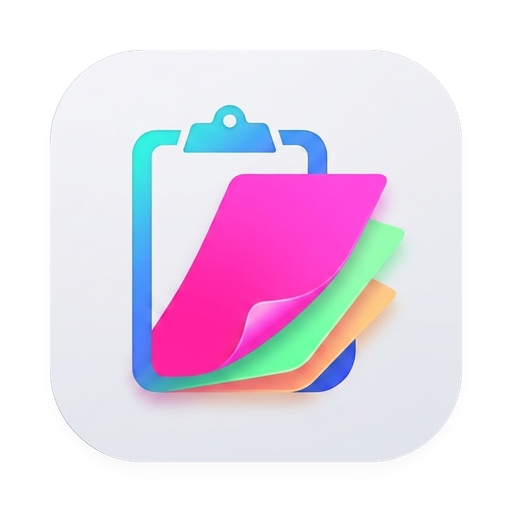

<p align="center">
  
</p>

# LibrePaste

LibrePaste is a lightweight, visual, and subscription-free clipboard history manager for macOS built natively with Swift and SwiftUI. It runs from the menu bar and bottom screen edge, providing fast, beautiful access to previously copied text, links, code, and images.

## Features

- **Native Architecture**: Built with Swift, SwiftUI, and AppKit with minimal CPU and memory overhead.
- **Adaptive UI**: Card headers extract and adapt to the dominant brand color of the source application icon.
- **Image Optimization**: ImageIO downsampling with memory and disk thumbnail caching for handling large images smoothly.
- **Rich Text & HTML Editor**: In-app WYSIWYG editor with support for rich formatting, HTML source editing, and JSON formatting.
- **Quick Look**: Press <kbd>Space</kbd> to inspect full-resolution media, formatted JSON, URLs, and character/word statistics.
- **Pinboards**: Organize clippings into custom-colored boards and pin frequently used items.
- **Privacy Controls**: Automatically ignores password managers (1Password, Bitwarden, Apple Keychain, KeePass), respects transient/concealed pasteboard types, and supports per-app exclusions and temporary incognito mode.
- **Persistent Storage**: Backed by SQLite in WAL mode with auto-pruning, configurable history limits, and database vacuum maintenance.
- **100% Free & Open**: No subscriptions, no telemetry, no paywalls.

## Keyboard Shortcuts

| Shortcut | Action |
|---|---|
| <kbd>⌘</kbd> + <kbd>⇧</kbd> + <kbd>V</kbd> | Toggle clipboard panel (configurable) |
| <kbd>↵</kbd> | Paste selected clip to active app |
| <kbd>⌥</kbd> + <kbd>↵</kbd> | Paste as plain text |
| <kbd>1</kbd> – <kbd>9</kbd> | Quick paste clip by position |
| <kbd>Space</kbd> or <kbd>P</kbd> | Toggle Quick Look preview |
| <kbd>E</kbd> | Edit clip |
| <kbd>⌘</kbd> + <kbd>⌫</kbd> | Delete clip |
| <kbd>Esc</kbd> | Close panel |

## Requirements

- macOS 14.0 (Sonoma) or later
- Apple Silicon or Intel 64-bit Mac
- Xcode 15.0+ (to build from source)

## Building from Source

1. Clone the repository:
   ```bash
   git clone https://github.com/bihv/LibrePaste.git
   cd LibrePaste
   ```

2. Open the project in Xcode:
   ```bash
   open LibrePaste.xcodeproj
   ```

3. Select the **LibrePaste** scheme and your Mac as the destination, then press <kbd>⌘</kbd> + <kbd>R</kbd> to build and run.

> **Note**: Accessibility permissions are required to simulate <kbd>⌘</kbd> + <kbd>V</kbd> when pasting directly into active applications.

## Project Structure

```
LibrePaste/
├── Models/        # Clip data models, types, and shortcut representations
├── Services/      # SQLite storage (WAL) and pasteboard monitoring service
├── ViewModels/    # Observable stores, search indexing, and filtering logic
├── Views/         # SwiftUI floating HUD panel, list cards, editor, and settings
└── Utilities/     # Image thumbnail cache, color extraction, and key event simulation
```

## License

This project is licensed under the [MIT License](LICENSE).
